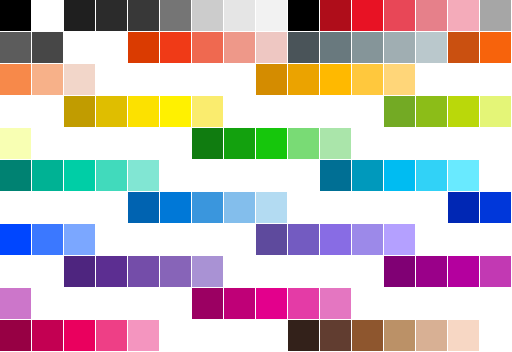

<h1 align="center">gg</h1>

<p align="center">
  <strong>2D Graphics Library for Go</strong><br>
  Pure Go | GPU Accelerated | Production Ready
</p>

<p align="center">
  <a href="https://github.com/gogpu/gg/actions/workflows/ci.yml"></a>
  <a href="https://codecov.io/gh/gogpu/gg"></a>
  <a href="https://pkg.go.dev/github.com/gogpu/gg"></a>
  <a href="https://goreportcard.com/report/github.com/gogpu/gg"></a>
  <a href="https://opensource.org/licenses/MIT"></a>
  <a href="https://github.com/gogpu/gg/releases"></a>
  <a href="https://github.com/gogpu/gg"></a>
</p>

<p align="center">
  <sub>Part of the <a href="https://github.com/gogpu">GoGPU</a> ecosystem</sub>
</p>

---

## Overview

**gg** is a 2D graphics library for Go designed to power IDEs, browsers, and graphics-intensive applications. Built with modern patterns inspired by [vello](https://github.com/linebender/vello) and [tiny-skia](https://github.com/RazrFalcon/tiny-skia), it delivers production-grade rendering with zero CGO dependencies.

### Key Features

| Category | Capabilities |
|----------|--------------|
| **Rendering** | Immediate and retained mode, GPU acceleration, CPU fallback |
| **Shapes** | Rectangles, circles, ellipses, arcs, bezier curves, polygons, stars |
| **Text** | TrueType fonts, MSDF rendering, emoji support, bidirectional text |
| **Compositing** | 29 blend modes (Porter-Duff, Advanced, HSL), layer isolation |
| **Images** | 7 pixel formats, PNG/JPEG/WebP I/O, mipmaps, affine transforms |
| **Vector Export** | Recording system with PDF and SVG backends |
| **Performance** | Tile-based parallel rendering, LRU caching |

---

## Installation

```bash
go get github.com/gogpu/gg
```

**Requirements:** Go 1.25+

---

## Quick Start

```go
package main

import (
    "github.com/gogpu/gg"
    "github.com/gogpu/gg/text"
)

func main() {
    // Create drawing context
    dc := gg.NewContext(512, 512)
    defer dc.Close()

    dc.ClearWithColor(gg.White)

    // Draw shapes
    dc.SetHexColor("#3498db")
    dc.DrawCircle(256, 256, 100)
    dc.Fill()

    // Render text
    source, _ := text.NewFontSourceFromFile("arial.ttf")
    defer source.Close()

    dc.SetFont(source.Face(32))
    dc.SetColor(gg.Black)
    dc.DrawString("Hello, GoGPU!", 180, 260)

    dc.SavePNG("output.png")
}
```

---

## Renderer Dependency Injection

gg supports pluggable renderers through the `Renderer` interface, enabling GPU acceleration via gogpu integration.

### Software Rendering (Default)

```go
// Default software renderer
dc := gg.NewContext(800, 600)
defer dc.Close()
```

### GPU Rendering via Native Backend

gg includes a built-in GPU backend using gogpu/wgpu:

```go
import (
    "github.com/gogpu/gg"
    "github.com/gogpu/gg/backend/native"
)

func main() {
    // Create GPU-accelerated context using native backend
    device := native.NewDevice()
    defer device.Destroy()

    // Draw with GPU acceleration
    device.DrawCircle(400, 300, 100)
    device.Fill()
}
```

For integration with gogpu windowing, see the `examples/gpu/` directory.

### Custom Pixmap

```go
// Use existing pixmap
pm := gg.NewPixmap(800, 600)
dc := gg.NewContext(800, 600, gg.WithPixmap(pm))
```

---

## Architecture

```
                        gg (Public API)
                             │
         ┌───────────────────┼───────────────────┐
         │                   │                   │
   Immediate Mode       Retained Mode        Resources
   (Context API)        (Scene Graph)     (Images, Fonts)
         │                   │                   │
         └───────────────────┼───────────────────┘
                             │
                    Renderer Interface
                             │
            ┌────────────────┼────────────────┐
            │                                 │
       Software                             GPU
       (Default)                     (backend/native/)
```

### Backend Structure

| Backend | Package | Description |
|---------|---------|-------------|
| **Native** | `backend/native/` | Pure Go WebGPU via gogpu/wgpu |
| **Rust** | `backend/rust/` | wgpu-native FFI via go-webgpu/webgpu |
| **Software** | `backend/software/` | CPU-based default renderer |

---

## Core APIs

### Immediate Mode (Context)

Canvas-style drawing with transformation stack:

```go
dc := gg.NewContext(800, 600)
defer dc.Close()

// Transforms
dc.Push()
dc.Translate(400, 300)
dc.Rotate(math.Pi / 4)
dc.DrawRectangle(-50, -50, 100, 100)
dc.SetRGB(0.2, 0.5, 0.8)
dc.Fill()
dc.Pop()

// Bezier paths
dc.MoveTo(100, 100)
dc.QuadraticTo(200, 50, 300, 100)
dc.CubicTo(350, 150, 350, 250, 300, 300)
dc.SetLineWidth(3)
dc.Stroke()
```

### Fluent Path Builder

Type-safe path construction with method chaining:

```go
path := gg.BuildPath().
    MoveTo(100, 100).
    LineTo(200, 100).
    QuadTo(250, 150, 200, 200).
    CubicTo(150, 250, 100, 250, 50, 200).
    Close().
    Circle(300, 150, 50).
    Star(400, 150, 40, 20, 5).
    Build()

dc.SetPath(path)
dc.Fill()
```

### Retained Mode (Scene Graph)

GPU-optimized scene graph for complex applications:

```go
scene := gg.NewScene()

scene.PushLayer(gg.BlendMultiply, 0.8)
scene.Fill(style, transform, gg.Solid(gg.Red), gg.Circle(150, 200, 100))
scene.Fill(style, transform, gg.Solid(gg.Blue), gg.Circle(250, 200, 100))
scene.PopLayer()

renderer := scene.NewRenderer()
renderer.Render(target, scene)
```

### Text Rendering

Full Unicode support with font fallback:

```go
// Font composition
mainFont, _ := text.NewFontSourceFromFile("Roboto.ttf")
emojiFont, _ := text.NewFontSourceFromFile("NotoEmoji.ttf")
defer mainFont.Close()
defer emojiFont.Close()

multiFace, _ := text.NewMultiFace(
    mainFont.Face(24),
    text.NewFilteredFace(emojiFont.Face(24), text.RangeEmoji),
)

dc.SetFont(multiFace)
dc.DrawString("Hello World! Nice day!", 50, 100)

// Text layout with wrapping
opts := text.LayoutOptions{
    MaxWidth:  400,
    WrapMode:  text.WrapWordChar,
    Alignment: text.AlignCenter,
}
layout := text.LayoutText("Long text...", face, 16, opts)
```

### Color Emoji

Full color emoji support with CBDT/CBLC (bitmap) and COLR/CPAL (vector) formats:

<p align="center">
  
  <br>
  <sub>175 colors from Segoe UI Emoji COLR/CPAL palette</sub>
</p>

```go
// Extract color emoji from font
extractor, _ := emoji.NewCBDTExtractor(cbdtData, cblcData)
glyph, _ := extractor.GetGlyph(glyphID, ppem)
img, _ := png.Decode(bytes.NewReader(glyph.Data))

// Parse COLR/CPAL vector layers
parser, _ := emoji.NewCOLRParser(colrData, cpalData)
glyph, _ := parser.GetGlyph(glyphID, paletteIndex)
for _, layer := range glyph.Layers {
    // Render each layer with layer.Color
}
```

See [`examples/color_emoji/`](examples/color_emoji/) for a complete example.

### Layer Compositing

29 blend modes with isolated layers:

```go
dc.PushLayer(gg.BlendOverlay, 0.7)

dc.SetRGB(1, 0, 0)
dc.DrawCircle(150, 200, 100)
dc.Fill()

dc.SetRGB(0, 0, 1)
dc.DrawCircle(250, 200, 100)
dc.Fill()

dc.PopLayer()
```

### Alpha Masks

Sophisticated compositing with masks:

```go
dc.DrawCircle(200, 200, 100)
dc.Fill()
mask := dc.AsMask()

dc2 := gg.NewContext(400, 400)
dc2.SetMask(mask)
dc2.DrawRectangle(0, 0, 400, 400)
dc2.Fill() // Only visible through mask
```

### Recording & Vector Export

Record drawing operations and export to PDF or SVG:

```go
import (
    "github.com/gogpu/gg/recording"
    _ "github.com/gogpu/gg-pdf" // Register PDF backend
    _ "github.com/gogpu/gg-svg" // Register SVG backend
)

// Create recorder
rec := recording.NewRecorder(800, 600)

// Draw using familiar API
rec.SetColor(gg.Blue)
rec.DrawCircle(400, 300, 100)
rec.Fill()

// Export to PDF
rec.Recording().SaveToFile("output.pdf", "pdf")

// Or export to SVG
rec.Recording().SaveToFile("output.svg", "svg")
```

---

## Why "Context" Instead of "Canvas"?

The drawing type is named `Context` following industry conventions:

| Library | Drawing Type |
|---------|-------------|
| HTML5 Canvas | `CanvasRenderingContext2D` |
| Cairo | `cairo_t` (context) |
| Apple CoreGraphics | `CGContext` |
| piet (Rust) | `RenderContext` |

In HTML5, Canvas is the element while **Context** performs drawing (`canvas.getContext("2d")`). The `Context` contains drawing state and provides the drawing API.

**Convention:** `dc` for drawing context, `ctx` for `context.Context`:

```go
dc := gg.NewContext(512, 512) // dc = drawing context
```

---

## Performance

| Operation | Time | Notes |
|-----------|------|-------|
| sRGB to Linear | 0.16ns | 260x faster than math.Pow |
| LayerCache.Get | 90ns | Thread-safe LRU |
| DirtyRegion.Mark | 10.9ns | Lock-free atomic |
| MSDF lookup | <10ns | Zero-allocation |
| Path iteration | 438ns | iter.Seq, 0 allocs |

---

## Ecosystem

**gg** is part of the [GoGPU](https://github.com/gogpu) ecosystem.

| Project | Description |
|---------|-------------|
| [gogpu/gogpu](https://github.com/gogpu/gogpu) | GPU framework with windowing and input |
| [gogpu/wgpu](https://github.com/gogpu/wgpu) | Pure Go WebGPU implementation |
| [gogpu/naga](https://github.com/gogpu/naga) | Shader compiler (WGSL to SPIR-V, MSL, GLSL) |
| **gogpu/gg** | **2D graphics (this repo)** |
| [gogpu/gg-pdf](https://github.com/gogpu/gg-pdf) | PDF export backend for recording |
| [gogpu/gg-svg](https://github.com/gogpu/gg-svg) | SVG export backend for recording |
| [gogpu/ui](https://github.com/gogpu/ui) | GUI toolkit (planned) |

---

## Documentation

- **[ARCHITECTURE.md](docs/ARCHITECTURE.md)** — System architecture
- **[ROADMAP.md](ROADMAP.md)** — Development milestones
- **[CHANGELOG.md](CHANGELOG.md)** — Release notes
- **[CONTRIBUTING.md](CONTRIBUTING.md)** — Contribution guidelines
- **[pkg.go.dev](https://pkg.go.dev/github.com/gogpu/gg)** — API reference

### Articles

- [GoGPU: From Idea to 100K Lines in Two Weeks](https://dev.to/kolkov/gogpu-from-idea-to-100k-lines-in-two-weeks-building-gos-gpu-ecosystem-3b2)
- [Pure Go 2D Graphics Library with GPU Acceleration](https://dev.to/kolkov/pure-go-2d-graphics-library-with-gpu-acceleration-introducing-gogpugg-538h)
- [GoGPU Announcement](https://dev.to/kolkov/gogpu-a-pure-go-graphics-library-for-gpu-programming-2j5d)

---

## Contributing

Contributions welcome! See [CONTRIBUTING.md](CONTRIBUTING.md) for guidelines.

**Priority areas:**
- API feedback and testing
- Examples and documentation
- Performance benchmarks
- Cross-platform testing

---

## License

MIT License — see [LICENSE](LICENSE) for details.

---

<p align="center">
  <strong>gg</strong> — 2D Graphics for Go
</p>
